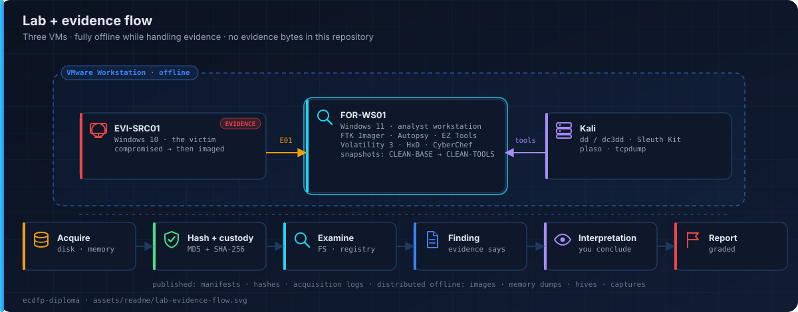

<p align="center"></p>

<p align="center">
  
  
  
  
  <a href="https://ebrahim-qareen.github.io/ecdfp-diploma/"></a>
</p>

Practical, instructor-led **Windows digital forensics**, built for the INE eCDFP (Certified Digital Forensics Professional) exam.

Six four-hour sessions. Every student at a keyboard. Every session ends in a verified acquisition and a written finding. Fourth course in the ITGate path: SOC Analyst → CEH → eCIR → **eCDFP**.

**Live site →** https://ebrahim-qareen.github.io/ecdfp-diploma/

## Course arc

<p align="center"></p>

| | Session | Domain |
|---|---|---|
| **S1** | Forensic Foundations, Evidence Integrity & Chain of Custody | Fundamentals + Preservation |
| **S2** | Acquisition — Disk, Memory & Live Response | Preservation + Storage |
| **S3** | Data Representation & File Examination | Fundamentals |
| **S4** | Storage Devices, Partitions & File Systems | Storage |
| **S5** | Windows Forensics — Registry, User Activity & Execution | Fundamentals |
| **S6** | Network Forensics, Timelines, Reporting & Capstone | Tools & Techniques |

One incident runs through all six sessions. It is acquired in S2 and cut deeper every session after, so students learn an investigation as one continuous arc. Each session is delivered as topic pages (`docs/page-01` … `page-14`), each ending in a report-backed lab task.

## Lab and evidence flow

<p align="center"></p>

| VM | Role |
|---|---|
| **FOR-WS01** | Windows 11 analyst workstation — FTK Imager, Autopsy, Eric Zimmerman tools, Volatility 3, HxD, CyberChef |
| **EVI-SRC01** | Windows 10 victim — compromised, then imaged |
| **Kali** | Linux tooling — dd / dc3dd, Sleuth Kit, plaso, tcpdump |

Setup guide: [`labs/setup_guide.md`](labs/setup_guide.md).

## Finding vs interpretation

This is the skill the course exists to teach. It is colour-coded on every page and graded on every report.

> **Finding.** `SYSTEM\MountedDevices` records volume GUID `{…}` for a device with serial `07A1…`.
>
> **Interpretation.** A removable device was attached to this host at least once while this hive was live.
>
> **Cannot prove.** Who attached it, or that any file was copied to it.

## Evidence policy

**No evidence bytes are in this repository, and none ever will be.**

- Published here: manifests, hashes (MD5 + SHA-256), acquisition logs, provenance and licence.
- Distributed offline: disk images, memory dumps, registry hives, raw captures.
- No real personal data, no real company, no real case. Every scenario is purpose-built.

Every push runs a credential scan, a PII scan and an evidence-bytes check.

## Repository layout

| Path | Purpose |
|---|---|
| `docs/` | The site — dashboard, 14 topic pages, shared CSS / JS |
| `design/` | Coverage matrix, topic map, scope decisions, design system |
| `knowledge_base/` | Condensed reference, one file per INE module |
| `packages/` | Instructor documents — in the repo, never served |
| `labs/` · `scripts/` · `tools/` · `testing/` | Lab design, generators, scan scripts, verification gate |
| `assets/readme/` | Diagrams used on this page |

`PROJECT.md` is the entry document. `DECISIONS.md` says why everything is the way it is.

## Running and verifying

```bash
python3 -m http.server --directory docs 8000                     # run the site (no build step)

python3 scripts/density_gate.py docs/page-NN/index.html          # bilingual density + terminology
python3 scripts/order_gate.py                                    # topic order and coverage
node   testing/render_gate.js docs/page-NN/index.html            # 1400 / 1100 / 900 / 700 / 480
powershell -File tools\precommit_scan.ps1                        # credentials · PII · evidence bytes
```

## Credits and licence

Course material © ITGate Academy. Built against INE's eCDFP curriculum; INE material is referenced, never republished. Third-party corpora and tools are credited and linked, not rehosted.

**Ebrahim Mohamed** — Lead Cybersecurity Instructor · SOC Analyst
[LinkedIn](https://linkedin.com/in/EbrahimMohamed) · [GitHub](https://github.com/Ebrahim-Qareen)
